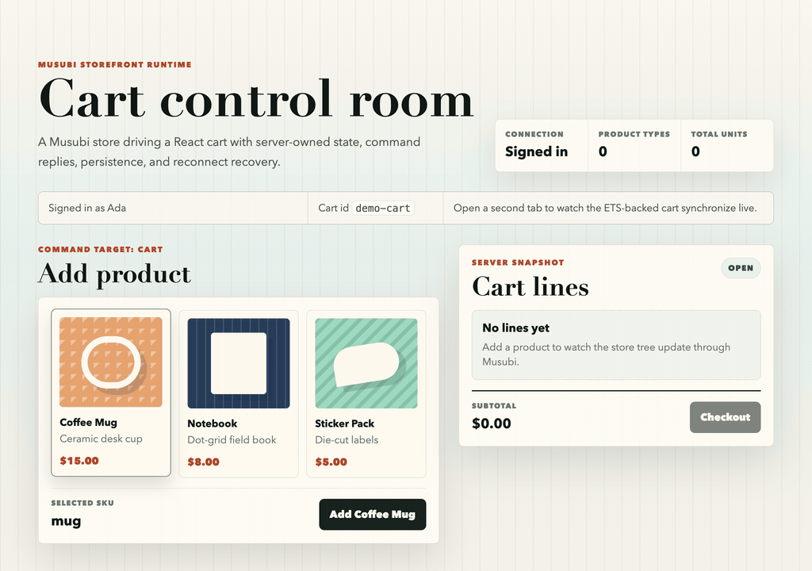

# cart_page

A command-driven shopping cart example built as a small Musubi store tree. It
demonstrates child store composition, command routing to a nested cart store
and to per-line child stores (BDR-0010 function attrs for parent callbacks),
lifecycle hooks for auth/audit, shared cart storage, cross-tab synchronization,
and reconnect recovery through the application persistence layer.



Adding catalog items, stepping line quantities through the per-line child stores,
reloading to show the persisted cart surviving a remount, then checking out.

## Store tree

```text
CartPage.Stores.CartPageStore (root)
  attrs: cart_id, current_user
  state:
    header  CartPage.Stores.HeaderStore
    cart    CartPage.Stores.CartStore

  CartPage.Stores.HeaderStore ("header")
    attrs: current_user
    state:
      signed_in  boolean
      user_name  string | nil

  CartPage.Stores.CartStore ("cart")
    attrs: cart_id, current_user
    state:
      lines           list(CartPage.Stores.CartLineStore)
      subtotal_cents  integer
      status          open | checking_out | checked_out

    CartPage.Stores.CartLineStore ("<line id>")
      attrs: line
      state:
        id, sku, name, price_cents, qty
```

## Commands

Cart commands route to the `["cart"]` store path; per-line commands route to
each line's child store proxy (`root.cart.lines[i]`).

| Target | Command | Payload | Reply | Behavior |
| :-- | :-- | :-- | :-- | :-- |
| cart | `add_item` | `{ sku: string }` | none or `{ error: "unknown_sku" }` | Adds a product line or increments the existing line quantity. |
| cart | `remove_line` | `{ id: string }` | none | Removes a cart line by line id. |
| cart | `checkout` | `{}` | `{ order_id: string }` or `{ error: "must_sign_in" }` | Requires a signed-in user, clears the cart, and marks the cart checked out. |
| line | `inc_qty` / `dec_qty` | `{}` | `{ qty: integer }` | Child mutates its own `:qty`, then notifies the cart store through the `on_qty_change` function attr; the cart store persists and recomputes totals. |

## Start the example

From the repository root, in two terminals:

```sh
cd examples/cart_page
mix server   # deps.get + run --no-halt
```

```sh
cd examples/cart_page
mix ui       # pnpm install + pnpm dev (in ui/)
```

Open http://localhost:4101.
