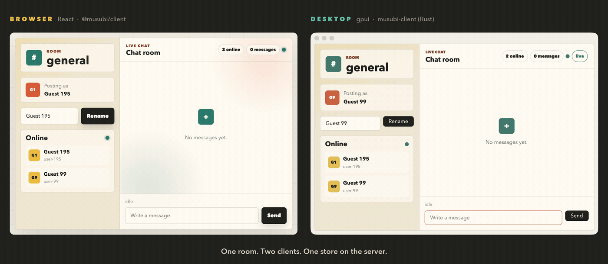

# chat_room

A real-time chat room example built as a single Musubi store. It demonstrates
async-seeded message streams (`stream_async`), Agent-backed online users via
`assign_async`, PubSub delivery, and `start_async` send handling over the
Phoenix Channel transport. Messages and presence are kept in
application-owned Elixir agents; each room stores and streams only the latest
100 messages. The mount path injects ~1.5s of artificial latency on the
history seed so the `loading → ok` `AsyncResult` transition is visible
client-side.



*Left: the React client in a browser. Right: the native gpui client. One `mix
server`, one store, one room — every rename and every message crosses between
them without either client knowing the other exists.*

## Store tree

```text
ChatRoom.Stores.ChatRoomStore (root)
  attrs: room_id
  state:
    messages          AsyncResult<stream of ChatRoom.MessageState>   # stream_async
    current_user      ChatRoom.OnlineUser
    online_users      AsyncResult<list(ChatRoom.OnlineUser)>         # assign_async
    last_send_status  idle | ok | failed                             # start_async
  uploads:
    attachment        UploadHandle                                   # upload :attachment
```

`attachment` is declared *outside* `state do` and is not state: the framework
injects the `{"__musubi_upload__": "attachment"}` marker into the render output
and drives the handle over a separate `upload_ops` stream. Each
`ChatRoom.MessageState` carries `attachment: ChatRoom.AttachmentState | nil` —
`nil` for a typed message, and set on the row the `attach` command appends.

## Commands

| Command | Payload | Reply | Behavior |
| :-- | :-- | :-- | :-- |
| `set_name` | `{ name: string }` | `{ ok: boolean, name: string }` | Updates the current user's display name and broadcasts the room's online-user list. |
| `send_message` | `{ body: string }` | `{ queued: boolean }` | Queues message delivery and updates `last_send_status` when the async task completes. |
| `attach` | `{}` | `{ attached: boolean, name: string \| null }` | Consumes the completed upload entry, moves the bytes into `ChatRoom.Attachments`, and appends a chat message referencing them. |

## Start the example

From the repository root, in up to three terminals:

```sh
cd examples/chat_room
mix server   # deps.get + run --no-halt
```

```sh
cd examples/chat_room
mix ui       # pnpm install + pnpm dev (in ui/)
```

```sh
cd examples/chat_room
mix desktop  # cargo run (in desktop/)
```

Open http://localhost:4102 for the React client; `mix desktop` opens a native
window. Both are optional and both can run at once — see below.

## Attachments

The room accepts one file per upload, in **channel mode** (no external
uploader), declared on the store:

```elixir
upload(:attachment,
  accept: ~w(.png .jpg .jpeg .gif .txt .md),
  max_entries: 1,
  max_file_size: 2_000_000
)
```

Both clients run the same three steps (`docs/uploads.md`):

1. `select(files)` — preflight. The server validates the extension and size
   against the declaration and signs one token per accepted entry.
2. `start()` — join `musubi_upload:<entry_ref>` and push the bytes as binary
   frames. Progress arrives back as `upload_ops`, not as state.
3. `dispatchCommand("attach", {})` — the entry is *not* consumed until a
   command asks for it: `consume_uploaded_entries/3` may only run inside a
   command handler, and the temp file the runtime hands over is deleted as soon
   as that handler returns.

Step 3 moves the bytes into `ChatRoom.Attachments` (an Agent, capped at the
newest 20 blobs) and calls `ChatRoom.Chat.send_message/4` with the resulting
`ChatRoom.AttachmentState`. The row therefore reaches *every* client — the
uploader included — over the ordinary PubSub broadcast and the `messages`
stream, one envelope after the reply (BDR-0009). Nothing about the file is read
out of the command reply.

`ChatRoomWeb.Router` serves the stored bytes at `/attachments/:id`, which is
what `AttachmentState.url` points at, so an uploaded image renders in the
browser client. `ui/vite.config.ts` proxies that path to port 4002 alongside
`/socket`.

### In the browser

Press **Attach file** in the composer dock and pick a file. The row's chip
shows an `` preview for an image and the name plus size for anything else.

Note the one wrinkle the example has to work around: `upload_ops` notify the
store's subscribers, but they change no state node, so `proxy.snapshot()` keeps
its identity and `useSyncExternalStore` bails out of the re-render. `App.tsx`
subscribes to the proxy directly and bumps a counter, which is what makes the
progress line repaint.

### In the desktop client

Press **Attach file** and the native macOS open panel appears
(`App::prompt_for_paths`). The app reads the bytes itself — `musubi-client`
never touches a filesystem — and hands them to the crate's `Upload` handle.

## Desktop client

`desktop/` is a native [gpui](https://www.gpui.rs) client for the same server,
same port, same store, same channel. It shares no code with `ui/`: the React
client consumes `@musubi/client` plus the generated TypeScript bundle
(`ui/src/generated/musubi.d.ts`), and the desktop client consumes the
`musubi-client` Rust crate plus the generated Rust bundle
(`desktop/src/generated.rs`). Both bundles are emitted from the same store
declarations by `mix compile`.

Run `mix ui` and `mix desktop` side by side against one `mix server` and the
point of the example shows up on screen: a message typed in the browser appears
in the native window, a rename in either moves a row in both presence lists, and
neither client knows the other exists. Only the server does.

What it demonstrates, beyond what the React client already shows:

- **`AsyncResult` in a nominal type system.** `messages` and `online_users` are
  both `AsyncResult<Vec<_>>` and both render through the same three-arm match.
  The mount path's artificial ~1.5s history delay makes the `loading → ok` flip
  visible on every start and every reconnect.
- **A hoisted tagged union.** `last_send_status` is declared inline in
  `state do`, and Rust cannot express an anonymous union — so the generated
  bundle names it `ChatRoomStoreLastSendStatus` and the delivery-receipt pill
  is a `match` the compiler forces to cover all three arms.
- **Reply before patch (BDR-0009).** `send_message` replies `{queued: true}`
  *before* the row exists. The client shows the reply on the feedback line and
  lets the row arrive one envelope later; the delivery pill flips on a second,
  independent patch when the `start_async` task settles. No state is ever read
  out of a command reply.
- **The upload data plane.** `upload :attachment` is the one feature that is not
  state: the snapshot carries an inert `UploadSlot`, and the live handle comes
  from `mounted.upload(&StoreId::root(), &slot.name)` with its own `updates()`
  stream. Progress repaints the composer dock without the message list
  re-rendering, because an upload op marks no `socket.assigns` key changed.
- **A runtime-free client.** `musubi-client` has no executor of its own, so
  `desktop/src/transport.rs` supplies the four seams over gpui's executor:
  `Spawner`/`Timer` on `BackgroundExecutor`, and a `Connector`/`Socket` pair
  over `async-net` + `async-tungstenite`, and is meant to be copied verbatim
  into other gpui apps.
- **The SWR mount cache, made durable.** `desktop/src/cache_store.rs` is a
  file-backed `CacheStore` (one JSON file at `~/.chat-room-desktop-cache.json`),
  another copy-me reference like `transport.rs`. Quit the app and run
  `mix desktop` again: identity and presence render instantly from the last
  session — under a "joining" pill, streams excluded (`docs/rust-client.md`
  §6.4) — and the live initial patch swaps the seed out atomically. Delete the
  file for a cold start.

### Requirements

- A recent stable Rust toolchain — `mise install` at the repo root provides
  the pinned one (`rust` in `mise.toml`). The crate declares
  `rust-version = "1.85"` (edition 2024), matching `musubi-client`'s MSRV.
- **macOS with the Metal Toolchain installed.** Xcode 26 unbundles the Metal
  compiler, and gpui's build script needs it:

  ```sh
  xcodebuild -downloadComponent MetalToolchain   # ~690 MB, no sudo
  xcrun -sdk macosx metal --version              # should print a version
  ```

  Without it the first build fails inside `gpui`'s build script with
  `cannot execute tool 'metal' due to missing Metal Toolchain`, which is easy to
  misread as a problem with the pin.
- Linux is best-effort and untested here; Windows is out of scope, because it
  needs gpui's git branch rather than the crates.io release.

### Notes

- **gpui is pre-1.0.** The crate pins `gpui = "0.2.2"` and
  `gpui-component = "0.5.1"` from crates.io and is detached from the repo's
  Cargo workspace; `desktop/Cargo.toml` says why for both. Bumping either is
  expected to require source changes.
- **`desktop/src/generated.rs` is committed**, exactly like the TypeScript
  bundle, and can therefore go stale. `mix compile.musubi_rust --check` reports
  drift without writing, and `mix compile --force` regenerates it. A plain
  `mix compile` only re-renders the bundle when a store module recompiles, so do
  not rely on `mix server` to refresh it. It will not damage it either: the
  codegen manifest lives in `_build/`, and if it is wiped without a recompile
  the compiler refuses to clobber a committed bundle from the resulting empty
  manifest — it keeps the file and prints the `mix compile --force` remedy.
- **The Musubi transport uses no tokio.** Not an empty `cargo tree -i tokio`,
  though — gpui itself depends on `gpui_http_client → zed-reqwest → hyper →
  tokio`, which this example never calls. The checkable statement is that every
  path to tokio runs through gpui:

  ```sh
  cd desktop && cargo tree -i tokio -e normal   # every path goes via gpui_http_client
  ```

  `musubi-client-tokio` is not a dependency, and `async-tungstenite` is pinned
  to `handshake` + `futures-03-sink` with its runtime and TLS features off.
- **The server URL** comes from `MUSUBI_URL`, defaulting to
  `ws://127.0.0.1:4002/socket`. There is no config file. The Musubi connector
  links no TLS stack of its own and rejects `wss://` rather than silently
  downgrading; gpui's HTTP client brings rustls in independently, and nothing
  on the Musubi path touches it.

### Reconnect demo

With the desktop client running, stop `mix server`. The message list stays
rendered — BDR-0015 says a client keeps its last good tree rather than blanking
— and the pill flips to "reconnecting" **on its own**: the crate publishes a
`MountStatus` stream (`Mounted::status_updates()`, BDR-0033), so the view
notices the moment the transport reports the drop, or within one heartbeat
interval (30 s by default) when the socket dies silently. No command is needed;
pressing **Send** during the window still fails with `Disconnected` on the
feedback line, coinciding with the pill rather than causing it. Restart the
server: the client rejoins, receives a fresh initial patch at `version: 1`, the
pill flips back to "live", and `messages` runs through `loading → ok` again
with the 1.5s seed delay, so the whole recovery contract is one observable
loop.
