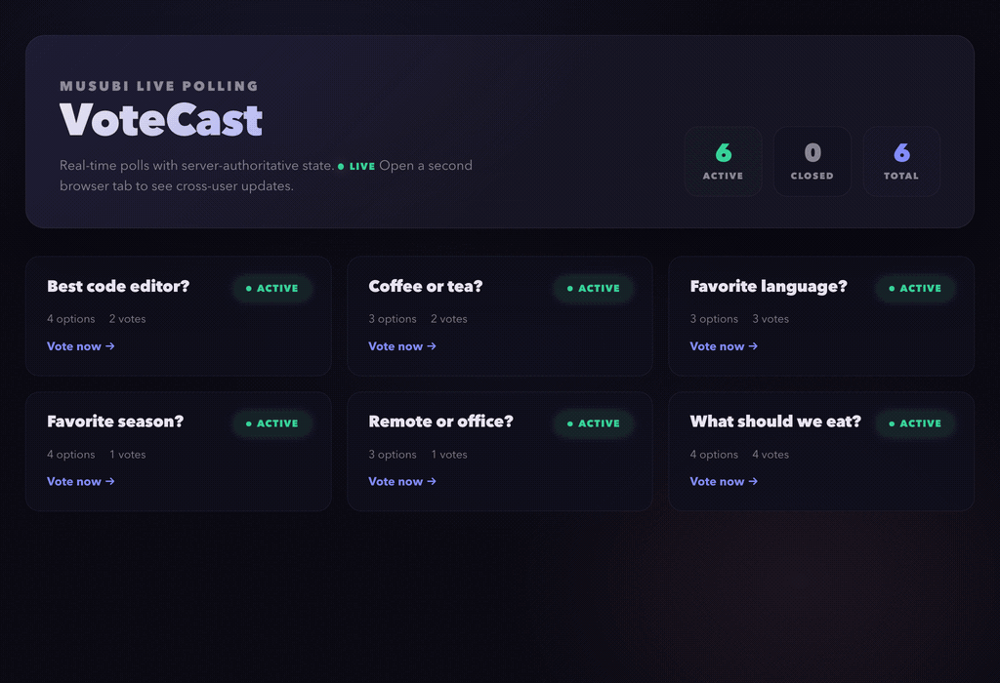

# VoteCast

A real-time live polling app built with Musubi. Demonstrates multi-page
architecture with typed render state, streamed options, async vote casting,
PubSub-driven cross-user updates, and polling status gating.



Browse the dashboard, cast and change a vote, then watch two tabs stay in sync
as one votes and the other closes the poll.

## Pages

| Page | Root Store | Child Stores | Key features |
| :-- | :-- | :-- | :-- |
| Dashboard | `PollApp.Stores.DashboardStore` | (none — typed header state) | Streamed poll cards, PubSub refresh |
| Poll Room | `PollApp.Stores.PollRoomStore` | (none — single store) | Streamed options, async vote commands, PubSub live updates |

## Store trees

```text
PollApp.Stores.DashboardStore (root)
  state:
    header   PollApp.DashboardHeader — poll counts
    polls    stream of PollApp.PollSummary

PollApp.Stores.PollRoomStore (root)
  attrs: poll_id
  state:
    poll       PollApp.PollDetail
    options    stream of PollApp.PollOption
    user_vote  AsyncResult<string | nil>
```

## Commands

### Poll Room

| Command | Payload | Reply | Behavior |
| :-- | :-- | :-- | :-- |
| `vote` | `{ option_id: string }` | `{ status: "voted" \| "closed" }` | Casts or changes your vote on the active poll. |
| `reset_vote` | `{}` | `{ status: "reset" }` | Removes your vote. |
| `toggle_status` | `{}` | `{ status: "active" \| "closed" }` | Opens or closes the poll. |

## Start the example

From the repository root, in two terminals:

```sh
cd examples/poll_app
mix server   # deps.get + run --no-halt
```

```sh
cd examples/poll_app
mix ui       # pnpm install + pnpm dev (in ui/)
```

Open http://localhost:4103. Open a second browser tab to see live cross-user
updates via PubSub.

## Seeded polls

Six polls are seeded on startup:

| Poll ID | Title | Options |
| :-- | :-- | :-- |
| `food-poll` | What should we eat? | Tacos, Pizza, Sushi, Ramen |
| `lang-poll` | Favorite language? | Elixir, Rust, TypeScript |
| `editor-poll` | Best code editor? | VS Code, Neovim, Helix, Zed |
| `work-poll` | Remote or office? | Remote, Office, Hybrid |
| `coffee-poll` | Coffee or tea? | Coffee, Tea, Neither — water |
| `season-poll` | Favorite season? | Spring, Summer, Autumn, Winter |
